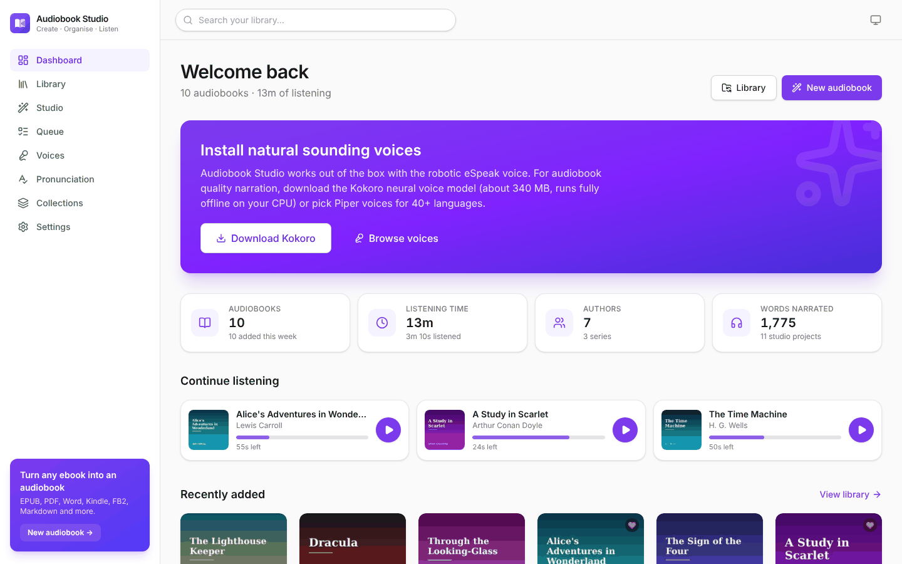
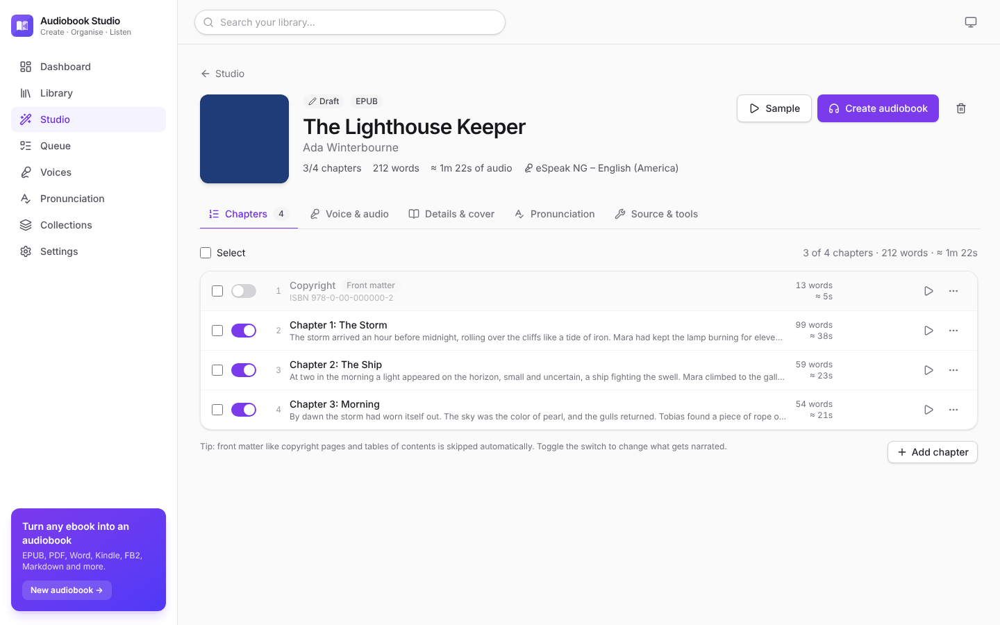
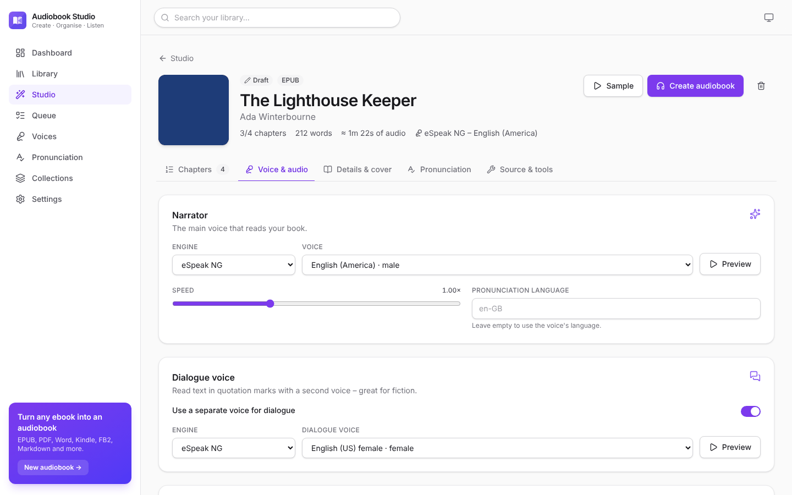
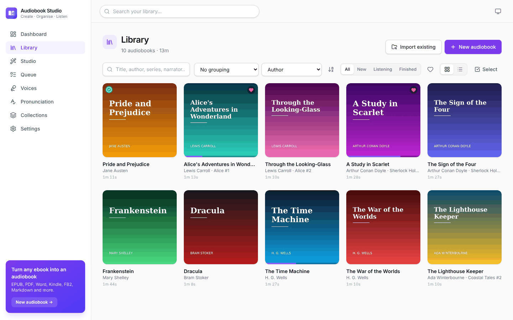
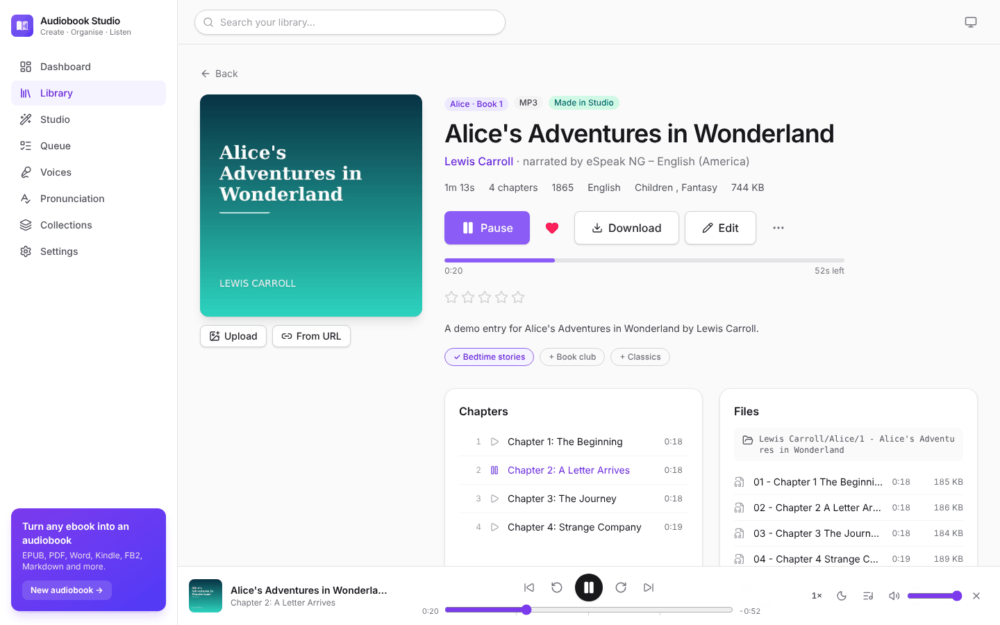

# Audiobook Studio

A self-hosted web app that turns **ebooks and PDFs into chaptered audiobooks** with natural-sounding,
offline text-to-speech — and keeps your whole **audiobook library organised** by author, series,
genre, narrator and more. Runs on any Linux machine with Docker or in an LXC container (Proxmox,
LXD/Incus), no cloud account required.



| Studio – review chapters | Voice & audio settings |
| --- | --- |
|  |  |
| **Library – grouped by series** | **Book page & player** |
|  |  |

## Features

**Create audiobooks**

- Import **EPUB, PDF, Word (DOCX), OpenDocument (ODT), Kindle (MOBI/AZW/AZW3, DRM-free), FictionBook (FB2),
  Markdown, HTML, plain text** (Project Gutenberg aware) – or just paste text.
- Automatic **chapter detection** from the table of contents, headings or “Chapter 7” style lines.
  Copyright pages, tables of contents and indexes are skipped automatically.
- PDF clean-up: running headers/footers and page numbers are removed, hyphenated words re-joined,
  paragraphs rebuilt across page breaks. **Scanned PDFs are OCR'd** with Tesseract.
- Title, author, series, description, ISBN, language and **cover art** are taken from the file.
- **Studio editor**: include/skip, rename, edit, split, merge, reorder and add chapters; preview any
  chapter or selection with the chosen voice before rendering.
- **Voices** (mix and match per book or even per chapter):
  - **Kokoro** – 82M parameter neural model, very natural, runs offline on the CPU (English US/UK,
    Spanish, French, Italian, Portuguese, Hindi, Japanese, Chinese). Includes a **voice blender**.
  - **Piper** – fast offline neural voices for 40+ languages, downloadable from the UI.
  - **eSpeak NG** – built in, robotic but instant, 100+ languages.
  - **Microsoft Edge voices** (optional, online).
  - **Any OpenAI-compatible speech API** – OpenAI, or your own GPU server running Kokoro-FastAPI,
    openedai-speech, AllTalk, LocalAI …
- **Dialogue voice**: text in quotation marks can be read by a second voice.
- **Pronunciation dictionary** (global and per book, plain text or regular expressions) plus automatic
  clean-up: abbreviations (Mr. → Mister), footnote markers, URLs, dashes, roman numerals in headings.
- Speed, pauses between sentences/paragraphs/scenes/chapters, chapter title announcements.
- Output as **M4B** (chapters, cover, tags), **MP3 per chapter**, **single MP3 with chapters** or
  **Opus**, with EBU R128 **loudness normalisation**.
- **Smart re-rendering**: after fixing a typo or adding a pronunciation rule only the affected
  chapters are narrated again.
- Persistent **background queue** with progress, ETA, logs, cancel and retry – it resumes after a restart.
- **Watch folder**: drop ebooks into the inbox (e.g. via a network share) and they are imported and,
  optionally, narrated automatically.

**Organise and listen**

- Library with grid and list views, **grouping by author, series, genre, narrator, language, year,
  collection or format**, search, filters (new / listening / finished / favourites) and sorting.
- **Collections**, ratings, favourites and **bulk editing**.
- Files are filed on disk by a **folder template** – `{author}/[{series}/][{series_index} - ]{title}` by
  default (Audiobookshelf/Plex friendly). Changing metadata re-tags the files and moves the folder.
- Sidecar files for other apps: `cover.jpg`, `desc.txt`, `reader.txt`, `metadata.json`.
- **Import existing audiobooks** (M4B, M4A, MP3, Opus, FLAC): tags, embedded chapters and covers are read.
- **Online metadata lookup** (Open Library and Google Books) for descriptions, genres and covers.
- Built-in **player**: multi-file books, chapter list, ±15/30 s, speed, sleep timer, remembers your
  position, lock-screen/media-key controls.
- **Podcast feeds** for the whole library and for every book – listen on your phone with any podcast app.
- Optional **password protection**, dark mode, works on phones, REST API with docs at `/api/docs`.

## Quick start with Docker

```bash
git clone <this repository>
cd audiobook-studio          # the folder containing this README
docker compose up -d --build
```

Open **http://localhost:8000**. On the dashboard click **Download Kokoro** (≈340 MB, one time) for
natural voices – the robotic eSpeak voice works immediately without any download.

The compose file stores everything in two folders next to it:

| Folder | Container path | Contents |
| --- | --- | --- |
| `./data` | `/data` | database, projects, downloaded voice models, `inbox/` watch folder |
| `./audiobooks` | `/audiobooks` | finished and imported audiobooks |

Set `PUID`/`PGID` in `docker-compose.yml` to your user id (`id -u`, `id -g`) so the files belong to you.
To share the library with Audiobookshelf, Plex or Jellyfin, point `./audiobooks` at their folder.

Plain `docker run`:

```bash
docker build -t audiobook-studio .
docker run -d --name audiobook-studio -p 8000:8000 \
  -e PUID=1000 -e PGID=1000 \
  -v "$PWD/data:/data" -v "$PWD/audiobooks:/audiobooks" \
  --restart unless-stopped audiobook-studio
```

Build arguments: `--build-arg OCR_LANGS="eng deu fra"` adds Tesseract languages for scanned PDFs
(`OCR_LANGS=""` leaves OCR out).

## Install in an LXC container (or any Debian/Ubuntu machine)

The installer sets up a Python environment, builds the web UI, creates a `audiobook` system user and a
systemd service. It works in Proxmox/LXD/Incus containers, VMs and on bare metal running **Debian 12+**
or **Ubuntu 22.04+**.

```bash
git clone <this repository>
cd audiobook-studio
sudo ./deploy/install.sh
```

The service listens on port 8000. Configuration lives in `/etc/audiobook-studio.env`, data in
`/var/lib/audiobook-studio` and audiobooks in `/srv/audiobooks` (change with `DATA_DIR=… LIBRARY_DIR=…`
when running the installer). Update by pulling the latest code and running the installer again.

```bash
systemctl status audiobook-studio
journalctl -u audiobook-studio -f
```

### Proxmox VE

On the Proxmox host, from a checkout:

```bash
./deploy/proxmox-lxc.sh                                  # creates a Debian 12 container and installs the app
CTID=120 CORES=6 MEMORY=6144 MEDIA_DIR=/tank/audiobooks ./deploy/proxmox-lxc.sh
```

`MEDIA_DIR` bind-mounts a host folder as the audiobook library. In unprivileged containers the
container's `audiobook` user maps to a high host uid – give it write access on the host (for example
`chown -R 100000+<uid> /tank/audiobooks`, or use ACLs).

### LXD / Incus

```bash
incus launch images:debian/12 audiobook-studio -c limits.memory=4GiB
incus file push -r audiobook-studio audiobook-studio/root/
incus exec audiobook-studio -- bash /root/audiobook-studio/deploy/install.sh
incus config device add audiobook-studio web proxy listen=tcp:0.0.0.0:8000 connect=tcp:127.0.0.1:8000
```

(Use `lxc` instead of `incus` on LXD.)

**Resources:** 2 CPU cores and 2 GB RAM are enough; 4+ cores make narration faster. Kokoro needs about
1 GB of RAM while narrating. Plan disk space for your audiobooks (64 kbps M4B ≈ 30 MB per hour).

## Creating an audiobook

1. **Studio → New audiobook** – drop one or more files (or paste text).
2. **Chapters** – check what gets narrated, fix chapter titles, edit or split text, preview passages.
3. **Voice & audio** – pick narrator (and optional dialogue) voice, speed, pauses and output format.
   *Use these settings for new projects* makes them the default.
4. **Pronunciation** – teach the narrator names and words (`Hermione → Her-my-oh-nee`).
5. **Create audiobook** – narration runs in the background (see **Queue**). The finished book appears in
   the **Library**, tagged, with cover and chapters, in the folder given by your template.

Edit chapters or rules later and click **Update audiobook**: only changed chapters are re-narrated.

## Voices

| Engine | Quality | Languages | Offline | Download |
| --- | --- | --- | --- | --- |
| Kokoro | ★★★★★ natural | en-US, en-GB, es, fr, it, pt-BR, hi, ja, zh | yes | ~340 MB once (int8 variant ~115 MB) |
| Piper | ★★★★ | 40+ | yes | 15–110 MB per voice |
| eSpeak NG | ★★ robotic | 100+ | yes | built in |
| Microsoft Edge | ★★★★★ | 100+ | no – text is sent to Microsoft | – |
| OpenAI-compatible | depends on server | depends | your server | – |

Voice models are downloaded from GitHub/Hugging Face into `data/models`. For offline machines copy the
files there manually: `models/kokoro/kokoro-v1.0.onnx` + `models/kokoro/voices-v1.0.bin`
([kokoro-onnx releases](https://github.com/thewh1teagle/kokoro-onnx/releases)) and Piper voices as
`models/piper/<voice>.onnx` + `<voice>.onnx.json` ([piper-voices](https://huggingface.co/rhasspy/piper-voices)).

Narration speed depends on your CPU: Kokoro typically renders faster than real time on a modern
multi-core CPU, Piper several times faster still. For large batches, run a GPU server with an
OpenAI-compatible API (e.g. Kokoro-FastAPI) and select the *OpenAI-compatible* engine.

## Library folder templates

`Settings → Library organisation` controls where books are stored:

| Template | Result |
| --- | --- |
| `{author}/[{series}/][{series_index} - ]{title}` | `Brandon Sanderson/Mistborn/1 - The Final Empire/` |
| `{author}/{title}` | `Jane Austen/Pride and Prejudice/` |
| `{genre}/{author}/{title}` | `Fantasy/Ursula K. Le Guin/A Wizard of Earthsea/` |
| `{first_letter}/{author_sort}/{title}` | `L/Le Guin, Ursula K./A Wizard of Earthsea/` |
| `{author}/[{series}/][Book {series_index:02} - ]{title}` | `…/Mistborn/Book 01 - The Final Empire/` |

Fields: `{author} {author_sort} {title} {subtitle} {series} {series_index} {genre} {year} {narrator}
{language} {publisher} {first_letter}`. Text in `[ ]` is dropped when a field inside it is empty;
`{series_index:02}` pads numbers. *Reorganise existing books* previews and applies a new template to the
whole library.

## Configuration

Environment variables (Docker `environment:` or `/etc/audiobook-studio.env`):

| Variable | Default | Description |
| --- | --- | --- |
| `STUDIO_DATA_DIR` | `./data` (`/data` in Docker) | database, projects, models |
| `STUDIO_LIBRARY_DIR` | `$STUDIO_DATA_DIR/library` (`/audiobooks` in Docker) | audiobook library |
| `STUDIO_INBOX_DIR` | `$STUDIO_DATA_DIR/inbox` | watch folder |
| `STUDIO_MODELS_DIR` | `$STUDIO_DATA_DIR/models` | TTS models |
| `STUDIO_HOST` / `STUDIO_PORT` | `0.0.0.0` / `8000` | listen address |
| `STUDIO_PASSWORD` | – | password for the web UI (otherwise set one in Settings) |
| `STUDIO_RENDER_WORKERS` | `1` | parallel narration jobs |
| `STUDIO_MAX_UPLOAD_MB` | `2048` | maximum upload size |
| `STUDIO_LOG_LEVEL` | `info` | logging level |
| `PUID` / `PGID` / `UMASK` | – | Docker only: user/group/umask the server runs as |

Everything else (default voice, output format, template, watch folder, engines, feeds, password) is
configured in the web UI under **Settings**.

Behind a reverse proxy (Nginx, Caddy, Traefik) serve the app on its own (sub)domain and forward
`X-Forwarded-Proto`/`Host` headers so podcast feed links are correct. Raise the upload size limit
(`client_max_body_size 1g;` in Nginx) for large PDFs.

## Podcast feeds

`Settings → Podcast feeds` shows the library feed URL; every book page has *Copy podcast feed URL*.
When a password is set the feed links contain a secret token that you can regenerate at any time.

## Development

```bash
# backend
cd backend
python3 -m venv .venv && . .venv/bin/activate
pip install -e ".[dev]"
pytest
STUDIO_DATA_DIR=../data python -m audiobook_studio --reload     # http://localhost:8000/api/docs

# frontend (proxies /api to :8000)
cd frontend
npm install
npm run dev                                                      # http://localhost:5173
```

Project layout:

```
backend/audiobook_studio/
  ingest/    ebook parsers (EPUB, PDF, DOCX, ODT, MOBI, FB2, TXT, Markdown, HTML)
  text/      clean-up, pronunciation rules, sentence chunking, dialogue detection
  tts/       engines (Kokoro, Piper, eSpeak NG, Edge, OpenAI-compatible) and model downloads
  audio/     chapter rendering, ffmpeg assembly (M4B/MP3/Opus), tagging
  library/   folder templates, import, covers, metadata lookup, podcast feeds
  jobs/      persistent background job queue
  api/       REST endpoints
frontend/src/  React + TypeScript + Tailwind single page app
deploy/        LXC / bare-metal installer, Proxmox helper
```

## Notes

- Only convert books you have the right to use. DRM-protected ebooks are not supported.
- Model licences: Kokoro weights are Apache-2.0; Piper voices come with individual licences (see each
  voice's model card); the Edge engine uses Microsoft's online service – check its terms before use.
